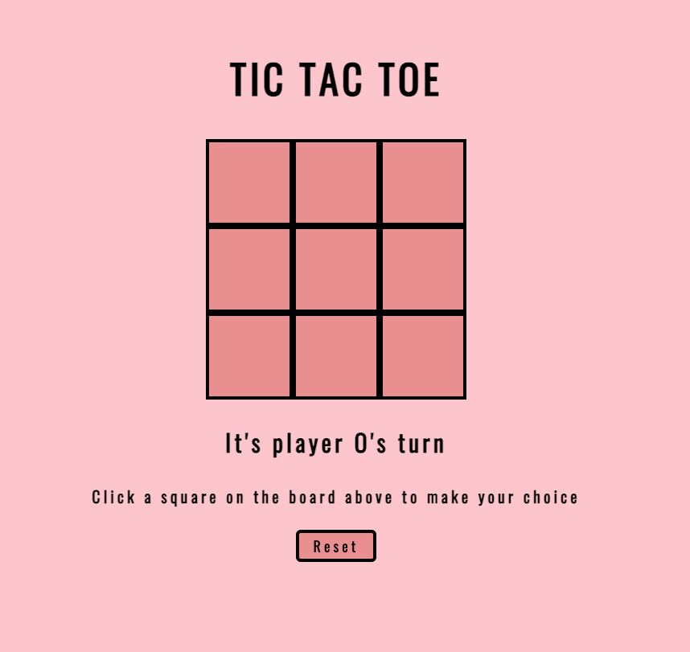
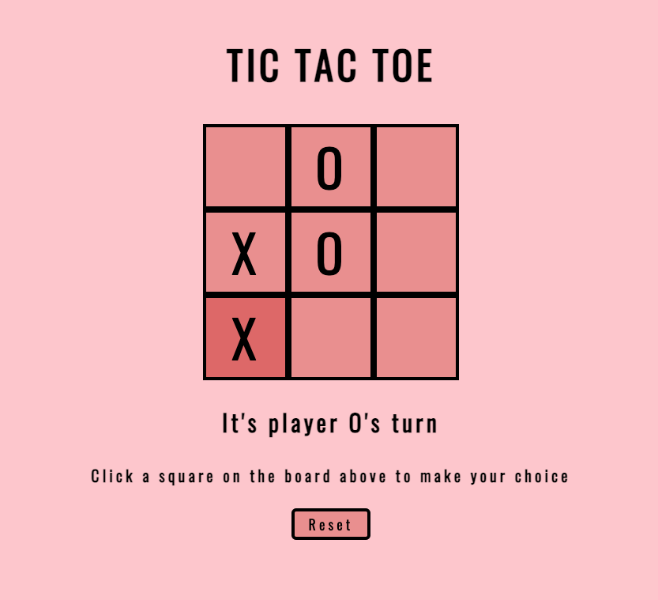

# Tic-Tac-Toe

## Description:
A tic tac toe game created in the first weekend of the General Assembly Software Immersive program.

## Technical Requirements
1. Display an empty tic-tac-toe board when the page is initially displayed
2. A player can click on the nine cells to make a move
3. Every click will alternate between X and O
4. Once occupied with an X or O, cell cannot be played again
5. Provide a reset button that will clear the contents of the board

## Bonuses
1. Display whose turn it is
2. Provide winning logic and display winning message
3. Provide logic for a tie game and display message
4. Style

## Technologies Used

## Getting Started

* [Link to Game](https://ea-tic-tac-toe.netlify.app/)

* Instructions: Click on a cell to make a move. Try to get three squares in a row!

## Game Screenshots:

 A screenshot showing a partially played tictactoe game 

 

## Project Hurdles: 

* The largest and only hurdle I had was basically the fact that I started learning JavaScript (my first ever computer language) five days ago. It's all new! But very fun, and very rewarding.

## Planning Resources:

[Link to Pseudocode](https://docs.google.com/document/d/1IeKPrgwJV5PkIwtOFQdFnIIayUFZrvIvtcsSS6KyJ4k/edit?usp=sharing)
